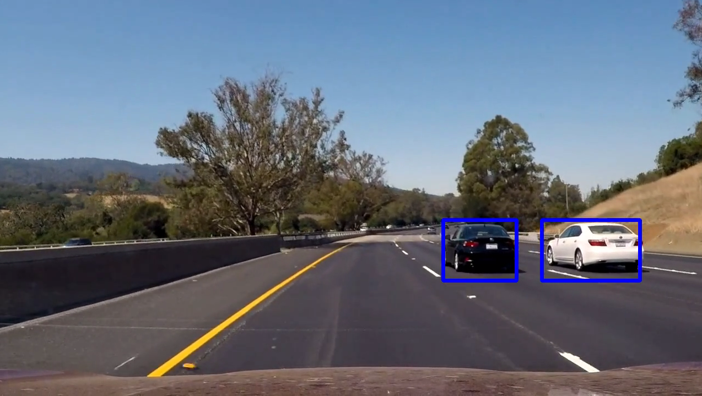

# Vehicle-Detection

In this project, I implemented a pipeline to detect vehicles in images. The following steps were performed:

1. Extract features using Histogram of Oriented Gradients (HOG) on a labeled training set of images 

2. Train a classifier Linear SVM classifier

3. Implement a sliding-window technique and use the trained classifier to search for vehicles in images.

4. Run the pipeline on a video stream and create a heat map of recurring detections frame by frame to reject outliers and follow detected vehicles.

5. Estimate a bounding box for vehicles detected.

The end result is shown below, with the full code available in the jupyter notebook. 

